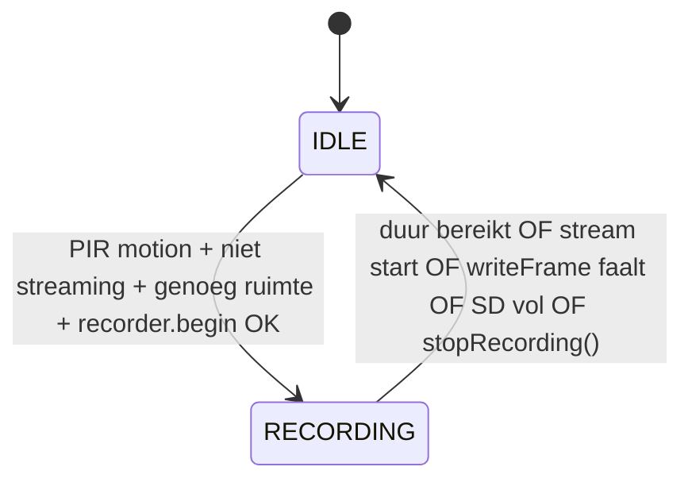

# NestboxCam — technische documentatie voor developers

Dit document beschrijft **hoe de firmware technisch in elkaar zit** en **wat de applicatie functioneel doet**, zodat een junior developer of een AI-agent zonder voorkennis kan navigeren in de codebase. Aanvullende gebruikers- en hardwareinformatie staat in [`README.md`](README.md).

---

## 1. Productdoel (functioneel)

NestboxCam is een **standalone nestkastcamera** op een **ESP32-CAM (AI Thinker)** met OV2640. De gebruiker krijgt:

| Functionaliteit | Beschrijving |
|-----------------|--------------|
| **PIR-gestuurde opname** | Bij beweging start een timer-gestuurde opname naar de SD-kaart als **AVI met MJPEG**-frames. |
| **Live beeld** | Via de browser: **MJPEG-stream** (`multipart/x-mixed-replace`) van JPEG-frames. |
| **Web-UI** | Dashboard (status, opslag, resolutie, opnameduur, foto), galerij met thumbnails, download/verwijderen. |
| **Foto** | Eén JPEG-frame opslaan via API/dashboard. |
| **Opslagbeheer** | Vrije ruimte-check, optioneel opruimen van oude **video**-bestanden (op basis van datum in de bestandsnaam). |

**Belangrijke beperking:** camera, SD en heap zijn schaars. **Live stream en PIR-opname tegelijk** worden vermeden: tijdens stream start geen nieuwe opname; een lopende opname stopt als de stream actief wordt.

---

## 2. Tech stack en build

| Onderdeel | Keuze |
|-----------|--------|
| **Platform** | [PlatformIO](https://platformio.org/), board `esp32cam`, framework **Arduino** voor ESP32. |
| **Partities** | `huge_app.csv` — grote app-partitie (geen OTA), nodig voor firmwaregrootte. |
| **PSRAM** | `-DBOARD_HAS_PSRAM` en cache-fix flags — AI Thinker heeft PSRAM; zonder PSRAM valt de camera in code terug op lagere resolutie. |
| **SD** | `SD_MMC` (1-bit mode in `StorageManager::begin` — eerste argument `true`). |
| **Camera** | ESP-IDF / Arduino stack: `esp_camera.h`, sensor OV2640. |
| **Web (HTTP)** | Standaard: `WebServer` (ESP32 Arduino) op poort **80**, plus een tweede luisteraar op poort **81** alleen voor **LED-API** tijdens MJPEG-stream (zie §7). |
| **Web (HTTPS)** | Optioneel: `USE_HTTPS 1` in `config.h` → library **fhessel/esp32_https_server**, self-signed cert, poort **443**. Pre-build script patcht `hwcrypto/sha.h` → `esp32/sha.h` (`extra_scripts/fix_https_server_sha.py`). |

**Bronmap:** alle firmwarebron staat onder `src/`. Er is geen aparte `lib/` in de repo; afhankelijkheden komen uit `platformio.ini` → `.pio/libdeps/`.

---

## 3. Bestandsstructuur en verantwoordelijkheden

| Bestand | Rol |
|---------|-----|
| `main.cpp` | **Orchestratie:** globale objecten, toestandsmachine IDLE/RECORDING, aanroep `loop()` van submodules, periodieke cleanup. |
| `config.h` | **Compile-time constanten:** WiFi, pins, camera defaults, PIR, NTP, poorten, `USE_HTTPS`. |
| `app_settings.*` | **Runtime-instellingen** (in RAM): gekozen `framesize_t` (VGA/SVGA/XGA) en opnameduur (10/20/30/60 s). Startwaarden komen uit `config.h`. |
| `wifi_manager.*` | WiFi STA, reconnect, **NTP** (`configTime` + `getLocalTime`). |
| `camera_control.*` | `esp_camera_init`, frame grab (`esp_camera_fb_get` / return), IR-LED op GPIO 4, dynamische resolutiewijziging. |
| `motion_detection.*` | GPIO PIR, **ISR** voor stijgende flank, opwarmtijd, debounce. |
| `video_recorder.*` | Schrijven **AVI RIFF**-header, `00dc`-chunks met JPEG-bytes, `idx1`, **header patch** na afloop via `fopen` r+b. |
| `storage_manager.*` | SD init, map `/videos`, lijst/sorteer bestanden, veilige delete-paden, `hasEnoughSpace`, **auto-cleanup** oude video’s. |
| `web_server.*` | Alle HTTP(S)-routes, MJPEG-stream, download met **Range**, thumbnails, JSON-API’s. |
| `web_pages.h` | **Ingebakken HTML** (PROGMEM raw strings): dashboard, live, galerij + client-side JS (fetch naar `/api/*`). |

---

## 4. Levenscyclus: `setup()` en volgorde

De volgorde in `setup()` is **bewust** en hangt samen met **GPIO 4** op ESP32-CAM (gedeeld: flash/IR **en** SD MMC data-lijn):

1. **`appSettingsInit()`** — zet RAM-instellingen gelijk aan `config.h`.
2. **`storage.begin()`** — SD eerst. Faalt dit → 10 s wachten → `ESP.restart()`.
3. **`camera.begin()`** — na SD. Faalt → log, systeem gaat verder (camera kan `false` zijn).
4. **`wifiMgr.begin()`** — verbindt met AP.
5. **`motion.begin()`** — PIR interrupt + start opwarmtimer.
6. **`webServer.begin()`** — start webserver (ook als WiFi even wegvalt; reconnect loopt in `loop`).

Zie `main.cpp` voor de exacte volgorde en commentaar over SD vóór camera.

---

## 5. Toestandsmachine (kernlogica)

De applicatie-kern in `main.cpp` gebruikt een enum `State { IDLE, RECORDING }`.

**IDLE**

- Roept `motion.motionDetected()` aan. Bij `true`: `startRecording()` als er geen stream is, voldoende vrije ruimte is, en `recorder.begin()` slaagt.
- Eens per uur (en direct na eerste IDLE-pass): `storage.deleteOldVideos(2)` — alleen als systeem in IDLE is (niet tijdens opname).

**RECORDING**

- Frames op vaste interval: `1000 / CAM_FPS_TARGET` ms.
- Per frame: `camera.captureFrame()` → `recorder.writeFrame()` → `camera.releaseFrame()`.
- Stopcondities: maximale duur `appRecordDurationSec()`, `webServer.isStreaming`, mislukte schrijfactie, `!storage.hasEnoughSpace()`.
- `webServer.isRecording` wordt gezet zodat de webserver clients kan informeren (503 op stream, API-gedrag).

**Gedeelde flags** (`WebServerManager`)

- `isRecording` — gezet door `main` bij start/stop opname.
- `isStreaming` — gezet in `handleStream` / HTTPS-equivalent rond de MJPEG-lus.
- `ledOn` — IR/flash LED; stream-end zet LED uit als die aan stond.

---

## 6. Modules in detail

### 6.1 `MotionDetection`

- **ISR** `pirISR` op **RISING** zet een volatile vlag `_triggered` (via singleton `_instance` — gebruikelijk patroon voor `attachInterrupt`).
- **`loop()`**: tot `PIR_WARMUP_MS` is er geen geldige detectie; daarna wordt opwarm-triggers gewist.
- **`motionDetected()`**: respecteert `PIR_DEBOUNCE_MS` tussen triggers; consumeert de vlag (één melding per trigger na debounce).

### 6.2 `CameraControl`

- Initialisatie met pinmap uit `config.h`, `PIXFORMAT_JPEG`, `frame_size` uit `appFrameSize()` (tenzij geen PSRAM → **CIF**).
- PSRAM: `fb_count = 2`, `CAMERA_GRAB_LATEST`; zonder PSRAM: 1 buffer, `CAMERA_GRAB_WHEN_EMPTY`.
- Sensor-tuning voor weinig licht (auto gain/exposure/AWB).
- **`setFrameSize`**: alleen na init, via `sensor_t::set_framesize` — gebruikt door `/api/settings` na validatie.

### 6.3 `VideoRecorder`

- **`HEADER_SIZE` = 252** bytes (RIFF/hdrl/strl/movi-header); eerste JPEG-frame begint op byte 252.
- Tijdens opname: per frame chunk `00dc` + little-endian lengte + JPEG bytes + optionele padding op even grens.
- Houdt in RAM een index (`MAX_INDEX` = **600** entries) voor `idx1`. Meer dan 600 frames → index wordt afgekapt (let op bij zeer lange clips hogere fps).
- **`finish()`**: schrijft `idx1`, sluit file, patcht RIFF-size, `totalFrames`, movi-LIST-size via `fopen(..., "r+b")` — nodig omdat `FILE_WRITE` truncate zou geven.

**Let op:** In `config.h` staat `AVI_HEADER_SIZE 240`; de **werkelijke** header in code is **252** (`VideoRecorder::HEADER_SIZE`). Bij wijzigingen altijd `video_recorder.*` als bron van waarheid gebruiken.

### 6.4 `StorageManager`

- **`newVideoFilename` / `newPhotoFilename`**: voorkeur voor NTP-tijd (`getLocalTime`); anders fallback met `millis()`.
- **`listVideos()`**: leest `/videos`, filtert `.avi`/`.jpg`, sorteert **nieuwste eerst** op tijdstempel in naam (`video_YYYY-MM-DD_HH-MM-SS` / `photo_...`), niet alleen lexicografisch op hele string.
- **`deleteVideo`**: pad moet onder `/videos` blijven; geen `..` of slashes in korte naam; extensie-check.
- **`deleteOldVideos`**: alleen bestanden waarvan de naam begint met `video_` en parsable datum heeft; **foto’s** worden hier **niet** automatisch verwijderd. Vereist geldige systeemtijd (`now >= 1577836800`).

### 6.5 `WiFiManager`

- `begin()`: STA + `connect()` met retries in één blok.
- `loop()`: bij disconnect periodiek opnieuw `connect()`; bij connect éénmalig `syncTime()` (NTP) tot 10 pogingen.

---

## 7. Webserver: routes en gedrag

Routes zijn parallel geïmplementeerd voor HTTP (`WebServer`) en HTTPS (`HTTPSServer` + wrappers); onderstaande paden gelden voor beide tenzij anders vermeld.

| Pad | Methode | Functie |
|-----|---------|---------|
| `/` | GET | Dashboard HTML (`HTML_DASHBOARD`) |
| `/live` | GET | Live-pagina HTML (`HTML_LIVE`) |
| `/videos` | GET | Galerij HTML (`HTML_VIDEOS`) |
| `/play` | GET | **302 redirect** naar `/videos` (in-browser afspelen uitgefaseerd) |
| `/stream` | GET | **MJPEG stream**; zet `isStreaming`; weigert bij `isRecording` of geen camera |
| `/thumbnail?file=` | GET | Eerste JPEG uit AVI of hele `.jpg`; bij falen 1×1 placeholder JPEG |
| `/download?file=` | GET | Bestand; **Accept-Ranges** + **206 Partial Content** voor video |
| `/delete?file=` | GET | JSON `{ok}` / fout |
| `/api/status` | GET | JSON: camera, recording, streaming, MB, video_count, resolution, record_sec, last_video, ip |
| `/api/videos` | GET | JSON: free_mb, total_mb, lijst name + size |
| `/api/led?state=on|off|toggle` | GET | JSON led-state; **HTTP:** ook bereikbaar op **poort 81** tijdens stream (zie hieronder) |
| `/api/settings` | GET | Zonder query: huidige resolution + record_sec. Met `resolution=` en/of `record_sec=` wijzigen (409 als record/stream actief) |
| `/api/capture` | GET | Eén foto naar SD, JSON met bestandsnaam |

**Waarom poort 81 (alleen HTTP)?** Tijdens `/stream` blokkeert de hoofd-webserver in een lange `while (client.connected())`-lus. De **LED-API** op dezelfde poort zou niet reageren. Daarom draait een minimale `WiFiServer` op **81** die alleen `GET /api/led` parsed; in de stream-lus wordt `processLedServer()` periodiek aangeroepen. Bij **HTTPS** gaat alles over dezelfde TLS-verbinding (`/api/led`).

---

## 8. Frontend (`web_pages.h`)

- Drie grote PROGMEM-strings: dashboard, live, galerij.
- **Geen build-stap voor assets** — wijzigingen = herbouwen firmware.
- Dashboard gebruikt **`fetch('/api/status')`** (polling) en roept `/api/settings`, `/api/capture` aan. Live-pagina gebruikt typisch `` of vergelijkbaar (zie volledige HTML in bestand).
- Base-URL voor LED in JS hangt af van protocol/poort (HTTP vs HTTPS) — belangrijk bij aanpassen van poorten.

---

## 9. API-contract (kort)

- **`GET /api/settings`** → `{"ok":true,"resolution":"vga|svga|xga","record_sec":N}`
- **`GET /api/settings?resolution=vga&record_sec=30`** → `{"ok":true}` of 400/409/500 met `{"ok":false,"error":"..."}`
- **`GET /api/capture`** → `{"ok":true,"file":"photo_....jpg"}` of 503/500

Geen authenticatie: app is bedoeld op **vertrouwd LAN**. Niet blootstellen aan het open internet zonder extra beveiliging.

---

## 10. Constanten en limieten die je moet kennen

| Item | Waarde / locatie | Gevolg |
|------|------------------|--------|
| `CAM_FPS_TARGET` | `config.h` | Opname-interval en stream-frame-interval |
| `appRecordDurationSec()` | 10, 20, 30, 60 | Alleen deze waarden via API |
| `MAX_INDEX` | `video_recorder.h` = 600 | idx1 max 600 frames betrouwbaar geïndexeerd |
| `MIN_FREE_MB` | `config.h` | Opname start/stopt rond vrije ruimte |
| `MAX_VIDEOS` | `config.h` | Gedefinieerd; controleer of overal enforced (bij uitbreidingen) |
| Cleanup-interval | `main.cpp` — 1 uur | Alleen in IDLE |
| Auto-cleanup leeftijd | `deleteOldVideos(2)` | 2 dagen, alleen `video_*` |

---

## 11. Debuggen en veelvoorkomende issues

- **Serial 115200** — alle modules loggen met prefixen `[Main]`, `[SD]`, `[REC]`, `[Web]`, `[WiFi]`, `[PIR]`, `[Camera]`.
- **Opname start niet:** stream actief? `hasEnoughSpace`? PIR nog in warmup? `recorder.begin` gefaald (SD)?
- **Lege of kapotte AVI:** header moet 252 bytes zijn; `finish()` moet draaien (patch). Check logs voor RIFF-magic na patch.
- **HTTPS handshake faalt:** bekend RAM-issue; README noemt beperkingen (1024-bit cert, max 2 connecties).
- **Thumbnail grijs:** eerste `00dc` niet gevonden binnen scanvenster of corrupte AVI; fallback is 1×1 JPEG.

---

## 12. Waar wijzig je wat?

| Wijziging | Waar beginnen |
|-----------|----------------|
| Nieuwe REST-route | `web_server.h` declaratie + `web_server.cpp` (HTTP én HTTPS-tak) + eventueel `web_pages.h` |
| Nieuwe compile-time pin/tijd | `config.h` |
| PIR-logica | `motion_detection.*` |
| Bestandsformaat / index | `video_recorder.*` |
| Sorteer/opslag/cleanup-regels | `storage_manager.*` |
| Opname-flow / timers | `main.cpp` |
| UI-tekst of JS | `web_pages.h` |

---

## 13. Relatie met README

- **Hardware, bedrading, partition scheme Arduino IDE, browser-downloadgedrag:** [`README.md`](README.md).
- Dit document focust op **codepaden, datastromen en API’s** voor implementatie en onderhoud.

---

*Laatste afstemming op de codebase: map `src/`, state machine en web-routes zoals in de firmware; controleer bij grote refactors of deze lijsten nog kloppen.*
